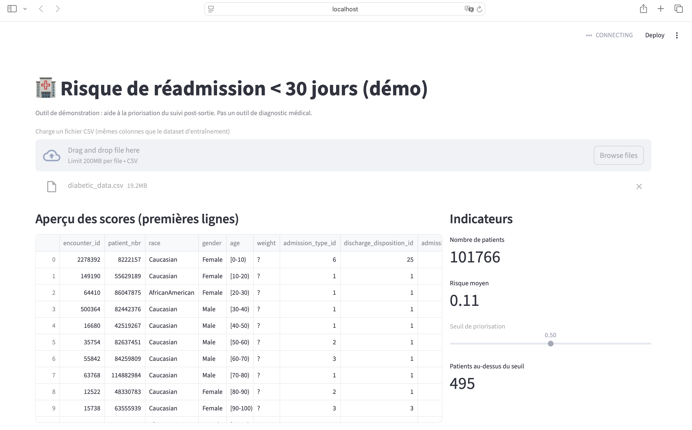
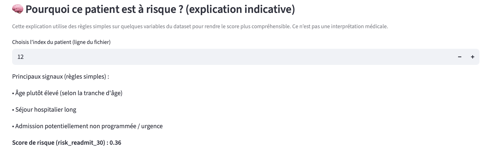

# Prediction of Hospital Readmission Risk (30 Days)

## Objective
This project demonstrates how a machine learning approach can support healthcare institutions
in prioritizing post-discharge follow-up by estimating the risk of patient readmission within
30 days after hospital discharge.

This project is a proof of concept (POC) intended for educational and portfolio purposes only.
It is not a medical diagnostic tool.

---

## Healthcare Context
Thirty-day readmission is a key indicator related to:
- quality of care,
- hospital workload,
- and healthcare costs.

A risk prioritization tool can help:
- identify patients requiring closer follow-up,
- better allocate healthcare resources,
- support clinical decision-making without replacing it.

---

## Machine Learning Approach
- Use of anonymized patient administrative and care pathway data
- Data preprocessing using a scikit-learn pipeline
- Interpretable logistic regression model
- Individual readmission risk score prediction
- Interactive web application built with Streamlit

---

## Technical Choices
- Logistic regression chosen for its simplicity and interpretability
- End-to-end machine learning pipeline for reproducibility
- Adjustable decision threshold based on operational constraints
- Lightweight Streamlit interface for rapid visualization

These choices favor robustness, clarity, and business understanding.

---

## Project Structure

---

## Features
- Readmission risk score per patient
- Tabular visualization with aggregated indicators
- Adjustable prioritization threshold
- Simple explanatory section: “Why is this patient at risk?”

---

## Application Overview

### Global View
Overview of patient risk scores and global indicators used for prioritization.



### Patient Risk Explanation
Indicative explanation of the main factors contributing to a patient's risk score.



---

## Running the Project Locally

```bash
python src/train.py
streamlit run app/app.py
